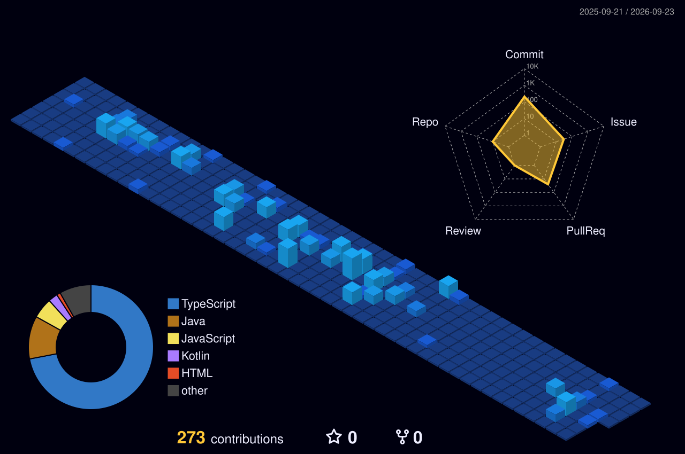

  

---

### Tecnologias e Ferramentas

  
  

---

### Métricas e Contribuições

  

 

  <table border="0">
    <tr>
      <td>
        
      </td>
      <td>
        
      </td>
    </tr>
  </table>

 

  

---

### Contato

   
  
  
  

