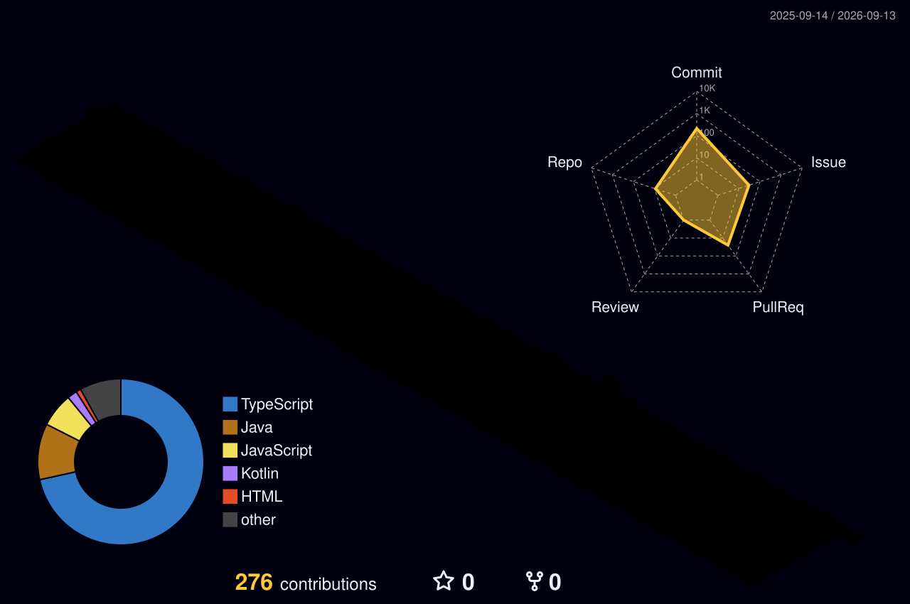

  

  Software developer in training, passionate about technology and problem-solving. Currently studying Systems Analysis and Development at IFSP (São Carlos). My focus is on building efficient applications, writing clean code, and seeking new challenges to constantly evolve in software engineering.

---

### Languages and Tools

  
  

---

 

  

---

   
  
  

